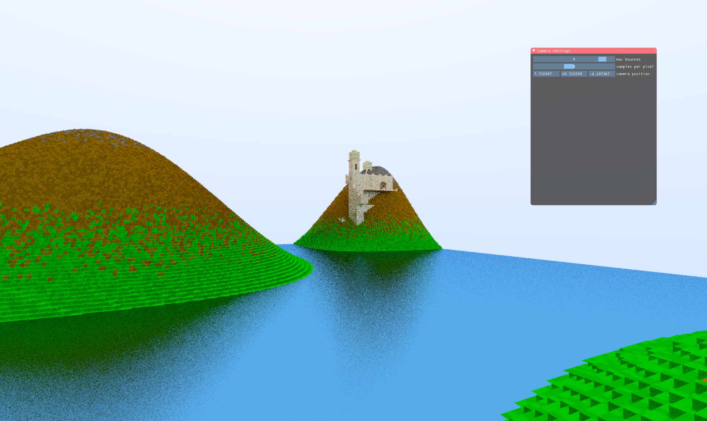

 

# Zig vulkan renderer

A toy renderer written in zig using vulkan and glfw

# Requirements

Zig build toolchain does most of the heavy lifting. The only systems
requirement is the [Vulkan SDK](https://www.lunarg.com/vulkan-sdk/). 
Make sure you download Vulkan 1.4 or up

**This project uses zig 0.14.0**

# Run the project

Do the following steps 
```bash
$ git clone --recurse-submodules -j4 <repo>
$ cd <folder>
$ zig build run
```

Or

```bash
$ git clone <repo>
$ cd <folder>
$ git submodule update --init --recursive
$ zig build run
```

# Run tests 

Currently the code base is not really well tested, but you can run the few tests by doin ``zig build test``

# Sources:

* Vulkan fundementals: 
  * https://vkguide.dev/
  * https://vulkan-tutorial.com
* Setup Zig for Gamedev: https://dev.to/fabioarnold/setup-zig-for-gamedev-2bmf 
* Using vulkan-zig: https://github.com/Snektron/vulkan-zig/blob/master/examples
